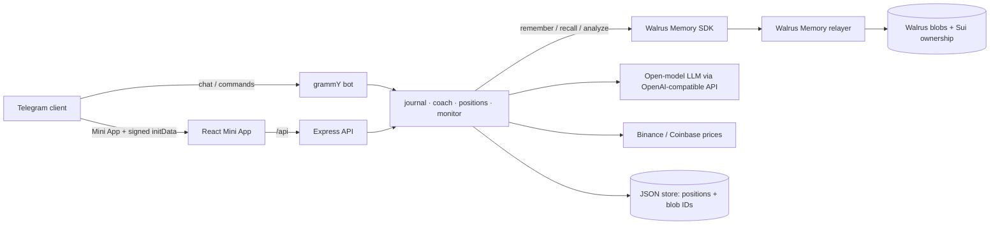

# Thesis Keeper

**A Telegram bot + Mini App that holds traders accountable to their own theses — powered by [Walrus Memory](https://docs.wal.app/walrus-memory).**

Before you open a trade, you write down *why*: the thesis, the target, the level where you're wrong.
Thesis Keeper seals it into your encrypted Walrus Memory with a sha256 fingerprint. Later — when a red candle
makes you want to panic-sell, or a pump makes you want to FOMO in — the bot recalls what *you* wrote when you
were calm, and what happened the last time you broke your own rules.

Built for **Walrus Session 8: Chatbots That Remember**.

---

## Why Walrus Memory is load-bearing here

| Feature | What Walrus Memory gives it that a normal database doesn't |
|---|---|
| **Proof of Thesis** — commit–reveal, verifiable by anyone | Each thesis is sealed privately in Walrus Memory *and* gets a public Walrus blob holding only `sha256(thesis + salt)` (no user ID). When the user reveals, a public page recomputes the hash in the visitor's browser and compares it with the blob fetched straight from a Walrus aggregator; the blob's Sui object dates it before the move. |
| **Before you enter** | While a position is being filled in, the app recalls similar past theses, check-ins and outcomes from Walrus Memory, shows the user's record on that asset, and an AI summary of what their own history says about this trade. |
| **My rules** | Durable rules ("never more than 5x on alts", "always set an invalidation") are distilled from lessons, notes and chat, saved as `[RULE]` memories, and enforced on every new position. Breaking one is allowed — and remembered in the thesis. |
| **Trade story** | On close, the trade's memories plus related recalled ones are turned into a short post-mortem and a lesson, written back to Walrus Memory as `[POST-MORTEM]` — one tap turns the lesson into a rule. |
| **Panic check** — "I want to sell everything" | Semantic `recall()` pulls the original thesis, its invalidation, and past emotional check-ins on the same asset, by meaning, not keywords. |
| **Private by default** | Positions and strategies are alpha. Memories are SEAL-encrypted and isolated per user (`owner + namespace`); the relayer never surfaces one user's memory to another. |
| **Trader DNA** | Insights are mined across the whole memory space ("times I panicked on news", "lessons learned") to surface recurring behavioural patterns. |
| **Learning from chat** | Free-form messages go through `analyze()`, so durable facts ("I never use more than 5x") become memories automatically. |
| **Bring your own memory (optional)** | Users can connect their *own* Walrus Memory account by pasting a delegate key from memory.walrus.xyz. New memories then live in their wallet's account under the namespace `thesis-keeper`, their history can be copied over, and any other app they authorise reads the same trading memory. Without it, memories stay in the app's account — nothing is required. |

### What gets remembered

Every memory is a self-contained, dated, human-readable sentence, so it recalls well and makes sense on its own:

```
[THESIS]   2026-10-04 14:36 UTC · Opened LONG BTC perp @ $78,000 (margin $500, 5x). Why: Spot ETF inflows keep growing…
           Target: $100,000. Invalidation: $72,000 / ETF outflows 2 weeks straight. Horizon: 3 months. Conviction: 4/5.
           Position 1c31…. Proof sha256:2f9c…
[CHECK-IN] 2026-10-09 09:12 UTC · BTC at $74,100 (-5.0% from entry, PnL -$125 / -25%) … User feels: scary headlines, want to close.
[OUTCOME]  2026-11-20 18:03 UTC · Closed … at $96,500 after 47 day(s). Result: profit $593 (118.6%). Thesis verdict: right.
           Reason for exit: target zone. Lesson learned: sitting through the -5% shakeout was the whole trade.
[NOTE]     2026-10-10 08:00 UTC · I always increase leverage after two winning trades in a row.
[ALERT]    2026-10-12 16:40 UTC · BTC invalidation at $71,800.
```

By default each user gets their own namespace in the app's account: `thesis-keeper:tg:<telegram_id>`.
Users who connect their own account write to the namespace `thesis-keeper` in *their* account instead.
Their delegate key is verified against the relayer (`/api/whoami`), stored AES-256-GCM encrypted
(`USER_KEY_SECRET`), and never sent back to the client. Disconnecting leaves their data in their account.

---

## Features

**Telegram Mini App**
- Portfolio overview with live prices (Binance → Coinbase fallback) and realized PnL by month
- **Spot and perp position simulator**: long/short, leverage 1–50x, isolated-margin liquidation price, ROE,
  risk/reward at target vs. invalidation, and a warning when liquidation comes before your invalidation
- **What-if slider** on every position — drag the price and see PnL/ROE/liquidation live
- Thesis cards with Walrus proof status and a Walruscan link
- Check-ins ("how do you feel about this trade?") answered by the coach using your memory
- Close flow that records the outcome, whether the thesis was right, and the lesson
- Coach chat, semantic memory search, Trader DNA insights, shareable track record

**Telegram bot**
- Chat with the coach about any trade, in any language
- `/positions` · `/recall <query>` · `/note <text>` · `/proof` · `/reset`
- **Price monitor** — when a position crosses its target, invalidation or nears liquidation, the bot sends an
  alert written from your own memories ("on Oct 4 you said you'd be wrong below $72k — is that what happened?")

---

## Architecture



- `server/` — Node + TypeScript. One process runs the bot (long polling), the API, the price monitor, and serves the built Mini App.
- `webapp/` — React + Vite Telegram Mini App.
- The JSON store only holds structured state needed to render the UI (positions, journal index, blob IDs).
  The *meaning* — theses, emotions, outcomes, lessons — lives in Walrus Memory.
- Mini App requests are authenticated by validating Telegram `initData` (HMAC-SHA256 with the bot token).

Key files: [`server/src/memory.ts`](server/src/memory.ts) (Walrus Memory wrapper),
[`server/src/journal.ts`](server/src/journal.ts) (what gets remembered and when),
[`server/src/coach.ts`](server/src/coach.ts) (how memories are recalled and used),
[`server/src/positions.ts`](server/src/positions.ts) (PnL / liquidation math).

---

## Setup

Requirements: Node.js 20+.

```bash
npm install
cp .env.example .env     # fill in the values below
npm run build
npm start
```

| Variable | Where to get it |
|---|---|
| `TELEGRAM_BOT_TOKEN` | [@BotFather](https://t.me/BotFather) → `/newbot` |
| `PUBLIC_URL` | Your public HTTPS URL (deploy, or a tunnel such as `cloudflared tunnel --url http://localhost:3000`) |
| `MEMWAL_PRIVATE_KEY`, `MEMWAL_ACCOUNT_ID` | [memory.walrus.xyz](https://memory.walrus.xyz) — create an account and a delegate key |
| `LLM_API_KEY` | e.g. [Groq](https://console.groq.com/keys) (free tier, open models). Any OpenAI-compatible endpoint works via `LLM_BASE_URL` / `LLM_MODEL`. |

Without Walrus credentials the app runs in **local memory mode** (clearly labelled in the UI) so you can develop offline.

### Local development

```bash
# terminal 1 — API + bot (set DEV_USER_ID=1001 in .env to use the Mini App in a normal browser)
npm run dev
# terminal 2 — Mini App with hot reload on http://localhost:5173
npm run dev:web
```

### Tests

```bash
npm test        # PnL / liquidation math and Telegram initData validation
npm run typecheck
```

### Deploy (Render)

`render.yaml` is included: create a Blueprint from the repo, fill in the secret env vars, and set
`PUBLIC_URL` to the service URL. A 1 GB disk keeps the JSON store across deploys. The bot sets its menu
button to the Mini App automatically on start.

---

## Usage proof

`GET /api/stats` returns aggregate counts (users, memories, memories stored on Walrus) without any personal data.

## Not financial advice

Thesis Keeper never tells you to buy or sell. It holds you to the rules *you* wrote.
